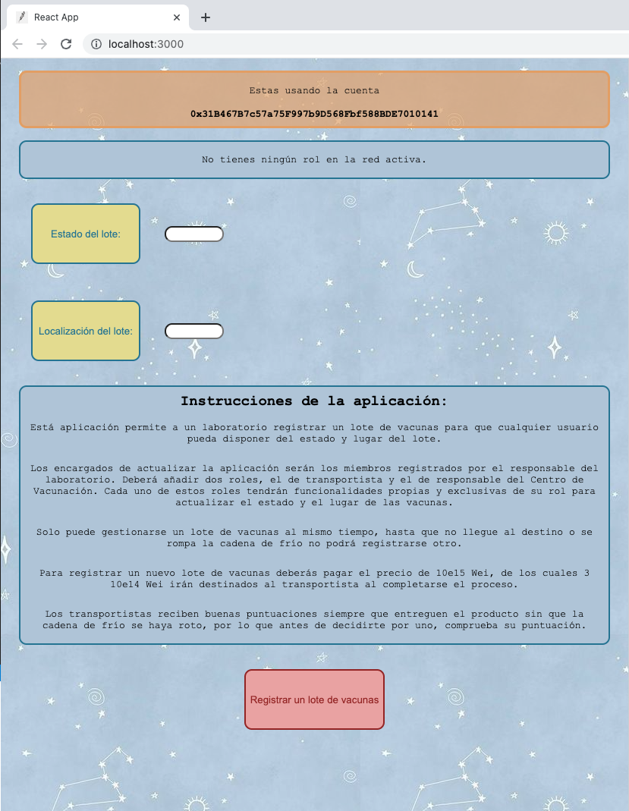

# Vaccine Network App

Este proyecto forma parte del Trabajo de Fin de Máster de Ciberseguridad y Privacidad de la UOC. Consiste en una aplicación basada en Ethereum para asegurar la cadena de frío de un lote de vacunas.



## Getting Started with Vaccine Network

You will need to install Node.js, Truffle and Metamask for Chrome Browser. 

## To get this box ##

1. Create a new directory.
2. Clone this repository in the new directory with ```git clone https://github.com/paulaot1495/TFM.git```

## Ganache: ##

To install Ganache-Cli globally, run:

```
npm install -g ganache-cli
```

Then open Ganache-Cli and then select ```Quickstart Ethereum```


## In the client directory: ##

```
npm install
```

## In the main project directory: ##

```
npm install
```
client/contracts/ will store all your Solidity (.sol files). This is where you will add any smart contracts, libraries, or interfaces that you need at compile time:
```
truffle compile
```
Migrations are JavaScript files that help you deploy contracts to the Ethereum network. These files are responsible for staging your deployment tasks, and they're written under the assumption that your deployment needs will change over time. This will run all migrations located within your project's migrations directory:

```
truffle migrate
```

## Launching the App: ##
In the client directory ```cd client``` you can run:
```
npm run start
```
Runs the app in the development mode.<br>
Open [http://localhost:3000](http://localhost:3000) to view it in the browser.

The page will reload if you make edits.<br>
You will also see any lint errors in the console.